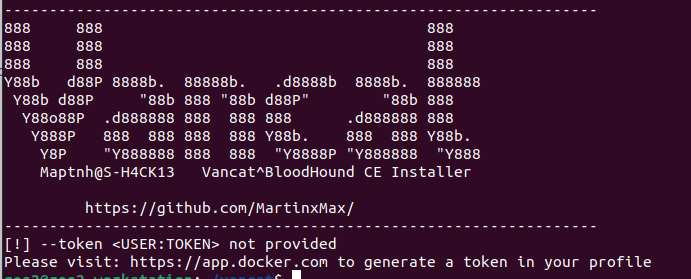
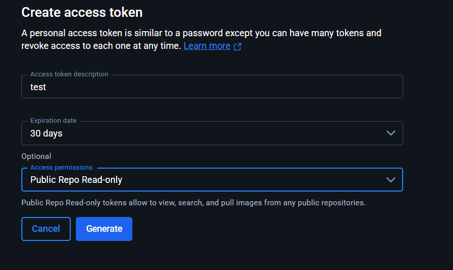
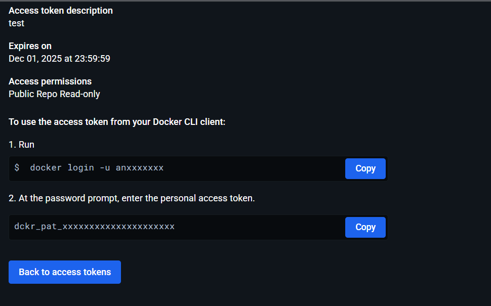
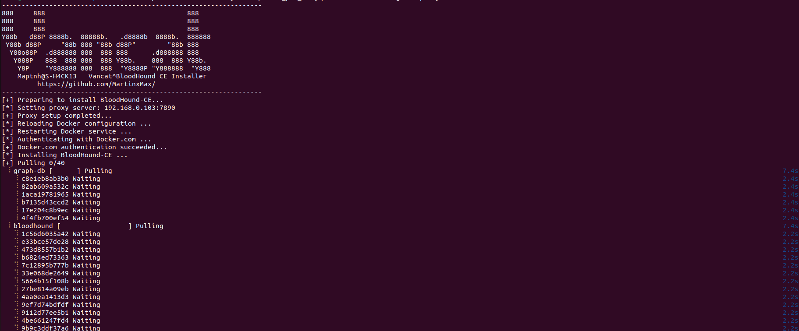
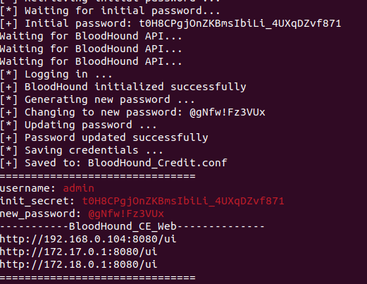
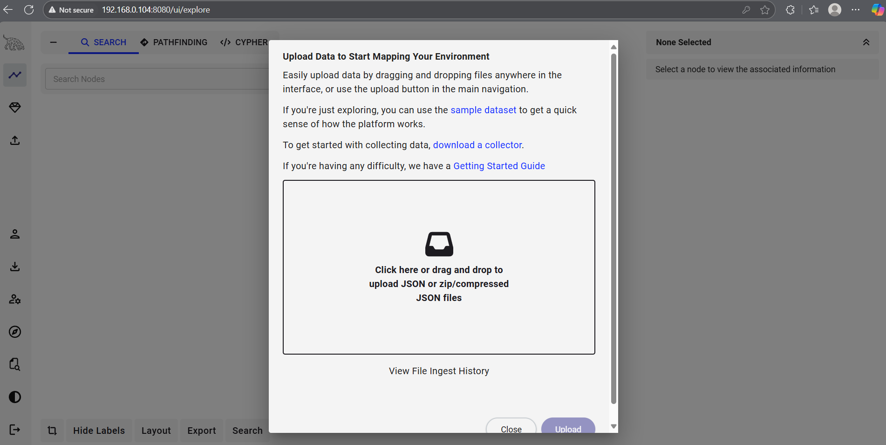
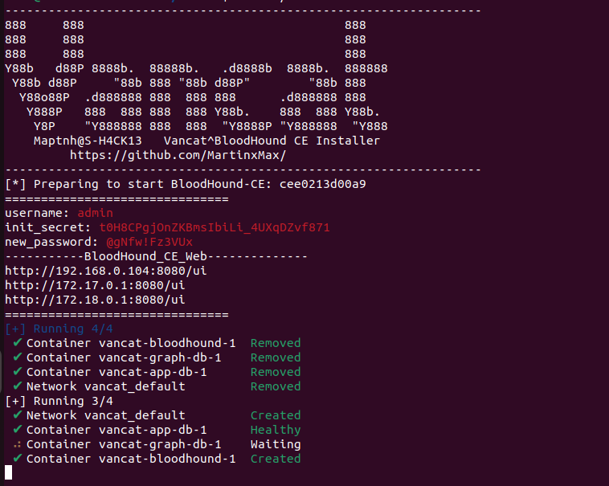
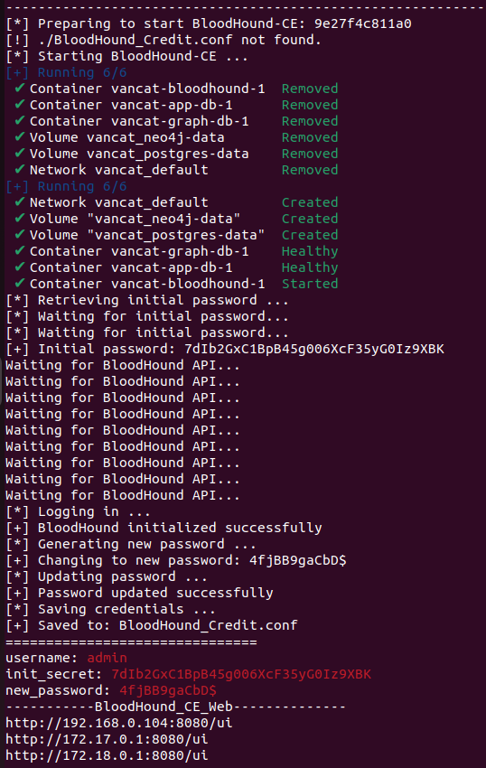
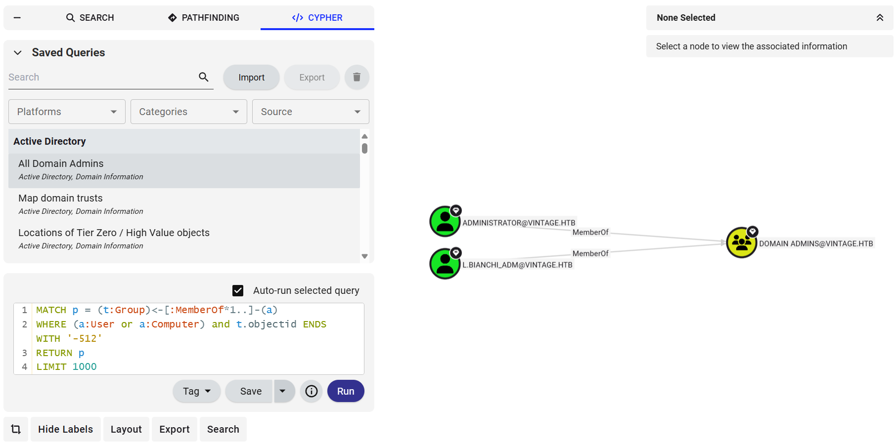

 

# Vancat

**Download**:https://github.com/MartinxMax/vancat/releases

```
                   _ |\_
                   \` ..\
              __,.-" =__Y=
            ."        )
      _    /   ,    \/\_
     ((____|    )_-\ \_-`
     `-----'`-----` `--`
```

1. Latest stable BloodHound-CE Linux-compatible installation shell script (2025)
2. Docker bypass for restricted networks
3. Automatic initialization of BloodHound admin password
4. Remote deployment, fast server-side setup

---

# Usage

## Docker Environment Installation

```bash
$ chmod +x ./run.sh
$ sudo ./run.sh
```



---

## Obtaining a Docker Token

Visit: [https://app.docker.com](https://app.docker.com)

Navigate to: **Settings → Personal Access Tokens**


Create a token:



Copy your username and token:



> Example: `anxxxxxxx:dckr_pat_xxxxxxxxxxxxxxxxxxxxx`

---

## Installing BloodHound CE and Initializing

If you are in a restricted region, try adding a proxy to bypass restrictions:

```bash
$ sudo ./run.sh --proxy <IP>:<PORT> --token anxxxxxxx:dckr_pat_xxxxxxxxxxxxxxxxxxxxx
```



---

> **Tips:** If the installation is interrupted for any reason, you can rerun it.
> Alternatively, remove the before rerunning using:

```bash
# Remove Docker (if needed)
docker rm -f vancat-bloodhound-1 vancat-app-db-1 vancat-graph-db-1 bloodhound
docker rmi -f specterops/bloodhound:latest postgres:16 neo4j:4.4.42
```

---

This will automatically update the admin password. A credential file `BloodHound_Credit.conf` will be generated in the current directory.




---

## How to Start BloodHound CE

Once installation is complete (and `BloodHound_Credit.conf` exists), you can start BloodHound directly:

```bash
$ sudo ./run.sh
```



---

## How to Reset BloodHound CE

Delete `BloodHound_Credit.conf` to force Vancat into reload mode (no network download needed):

```bash
$ sudo rm BloodHound_Credit.conf
$ sudo ./run.sh
```




---
 
